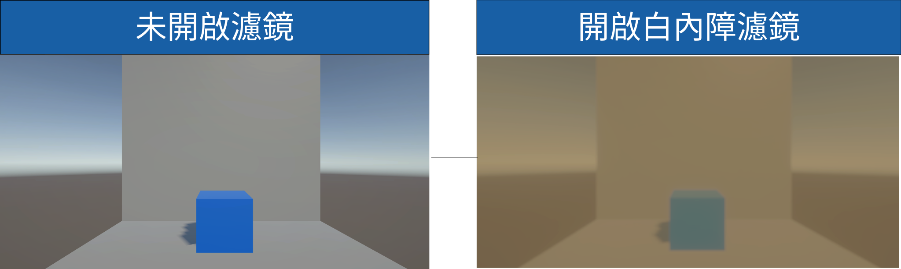
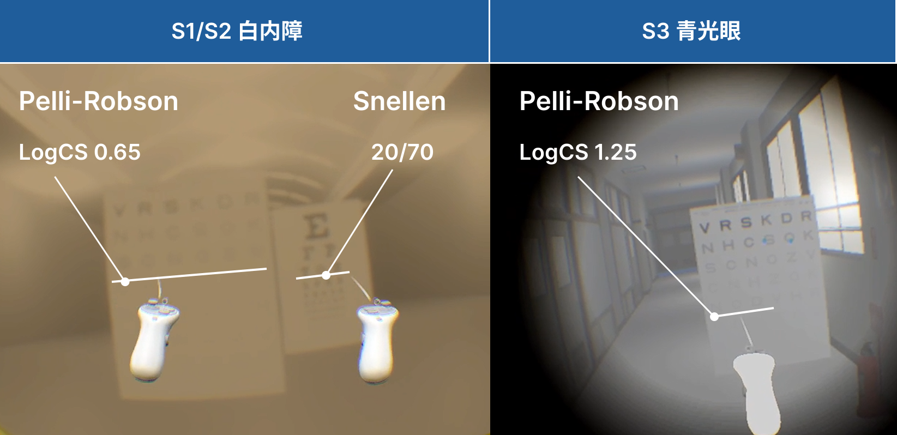
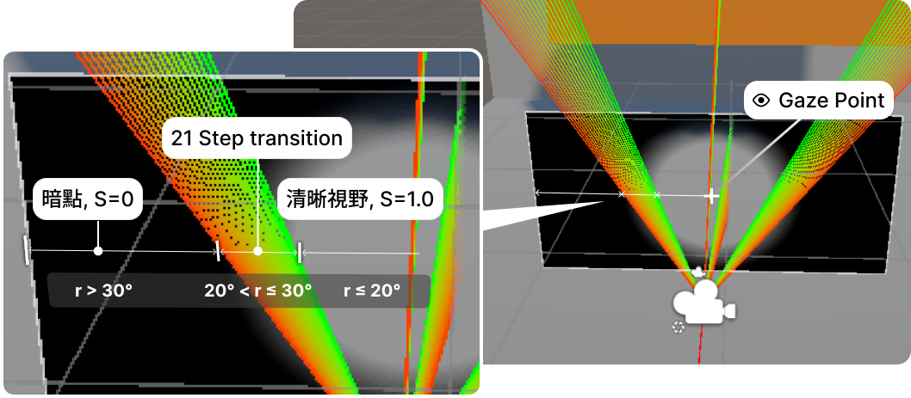
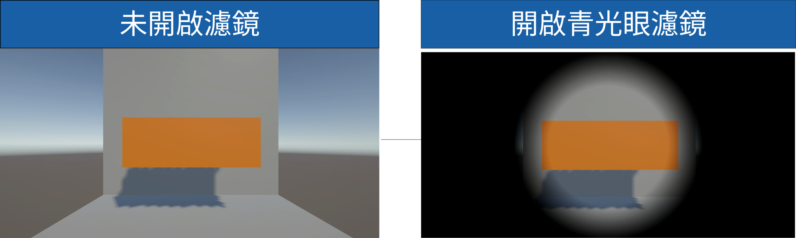
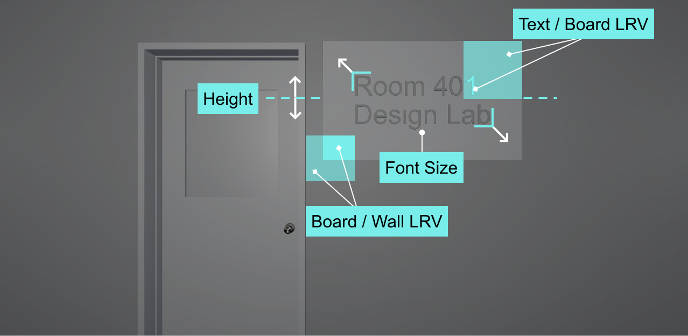
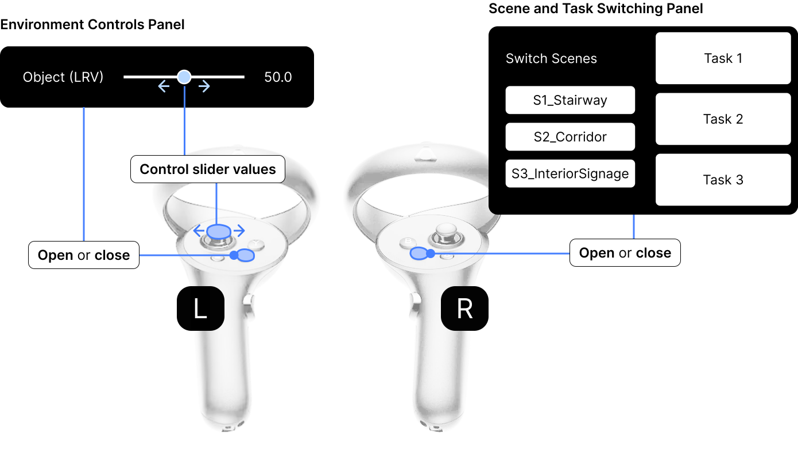
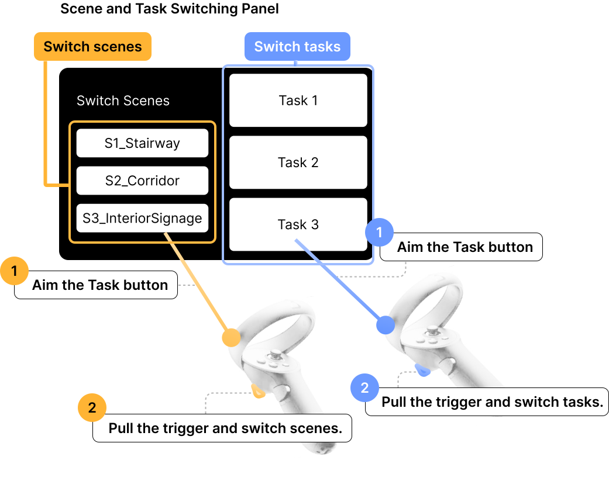

<p align="center">
  
</p>

<h1 align="center">Visual_Impairment_PE_VR</h1>

<p align="center">VR/AR visual impairment simulation project built in Unity (URP). Simulates various visual impairment conditions in immersive scenarios for perception/accessibility research.</p>

<p align="center">
  
</p>

## Scenes

- **S1 – Stairway Profile**: Stair navigation with contrast control
- **S2 – Corridor Profile**: Corridor navigation with contrast control
- **S3 – Interior Signage Profile**: Indoor wayfinding and signage
- **VC1 – VSCS Profile (Cataract)**: Cataract simulation, Pelli-Robson contrast chart
- **VC2 – VF Profile (Glaucoma)**: Visual field loss / glaucoma simulation

<p align="center">
  
  
  
</p>

## Project structure

```
Assets/
├─ _Core/                 Core project: scenes, shared scripts, shared settings
│  ├─ Scenes/             S1_Stairway, S2_Corridor, S3_InteriorSignage
│  ├─ Scripts/            Shared framework + VR fixers — see Key Scripts below
│  ├─ Prefab/
│  └─ Settings/
├─ _Demo/                 Visual-impairment simulation modules, one folder per condition
│  ├─ VC1-VSCS/Cataract/  Cataract simulation
│  ├─ VC2-VF/Glaucoma/    Glaucoma / visual field loss simulation
│  ├─ VC2-VF/Scripts/     Eye-tracking data plumbing (feeds the Glaucoma simulation)
│  ├─ EyeTracking/        Gaze data recording/logging sandbox
│  ├─ EnvP_CS/            Environment contrast-sensitivity adjustment demo
│  ├─ EnvP_Lux/           Environment exposure adjustment demo
│  └─ EnvP_Pos/           Environment object-position adjustment demo
└─ _ThirdParty/           Third-party assets (external environment packs, XRI samples, dependency resolvers)
```

## Key scripts

### Common framework

Shared by all scenes, in [`Assets/_Core/Scripts/Common`](Assets/_Core/Scripts/Common):

- [`ISimulationController.cs`](Assets/_Core/Scripts/Common/ISimulationController.cs) — interface every per-simulation controller implements (`ApplyVariant`, `UpdateAll`)
- [`SimulationVariantData.cs`](Assets/_Core/Scripts/Common/SimulationVariantData.cs) — ScriptableObject describing one simulation variant (which scene, which parameters)
- [`SimulationVariantManager.cs`](Assets/_Core/Scripts/Common/SimulationVariantManager.cs) — runtime singleton that applies the selected variant
- [`SimulationVariantSelector.cs`](Assets/_Core/Scripts/Common/SimulationVariantSelector.cs) — auto-generates the VR menu buttons for picking a variant
- [`SceneNavigationManager.cs`](Assets/_Core/Scripts/Common/SceneNavigationManager.cs) — handles scene loading/switching
- [`VRMenuJoystickNavigator.cs`](Assets/_Core/Scripts/Common/VRMenuJoystickNavigator.cs) — redirects the left-hand joystick to navigate/adjust menu sliders

VR environment/UI fixers ([`Assets/_Core/Scripts/Helpers`](Assets/_Core/Scripts/Helpers)): `VRCanvasFixer.cs`, `VREnvironmentFixer.cs`, `VRDebugOverlay.cs` — patch common XR Interaction Toolkit UI/raycast quirks (event camera, tracked raycasters, gaze interactors stealing UI focus).

### Cataract ([`VC1-VSCS/Cataract`](Assets/_Demo/VC1-VSCS/Cataract))

- [`CataractVolumeControl.cs`](Assets/_Demo/VC1-VSCS/Cataract/CataractVolumeControl.cs) — drives the URP Volume (blur, contrast, yellowing) from a Snellen-acuity setting
- [`PelliRobsonChart.cs`](Assets/_Demo/VC1-VSCS/Cataract/PelliRobsonChart.cs) — generates the in-scene Pelli-Robson contrast-sensitivity chart

<p align="center"></p>

The four composited cataract effects (blur, contrast-sensitivity loss, intraocular scatter, yellowing) driven by `CataractVolumeControl.cs`, before vs. after.

<p align="center"></p>

The Snellen chart (cataract visual-acuity check) and Pelli-Robson chart (contrast-sensitivity check, shared by both Cataract and Glaucoma) are embedded directly in the scene so the simulated effect strength can be visually calibrated by eye against a known reference — see `PelliRobsonChart.cs` above.

### Glaucoma ([`VC2-VF/Glaucoma`](Assets/_Demo/VC2-VF/Glaucoma))

- [`GlaucomaFieldGenerator.cs`](Assets/_Demo/VC2-VF/Glaucoma/GlaucomaFieldGenerator.cs) — defines the visual-field-loss zone geometry
- [`GlaucomaVRAligner.cs`](Assets/_Demo/VC2-VF/Glaucoma/GlaucomaVRAligner.cs) — aligns the field-loss geometry to the headset's per-eye view
- [`GlaucomaRenderer.cs`](Assets/_Demo/VC2-VF/Glaucoma/GlaucomaRenderer.cs) — drives the overlay from the generated field
- [`GlaucomaBlurFeature.cs`](Assets/_Demo/VC2-VF/Glaucoma/GlaucomaBlurFeature.cs) — URP Renderer Feature for the blur pass
- [`GlaucomaOverlay.shader`](Assets/_Demo/VC2-VF/Glaucoma/GlaucomaOverlay.shader) — custom overlay shader (not Volume-based)

<p align="center"></p>

Visual-field sensitivity function and eye-gaze alignment — the model behind `GlaucomaFieldGenerator.cs` / `GlaucomaVRAligner.cs`.

<p align="center"></p>

Image-mask approach to restricting the visible field — what `GlaucomaRenderer.cs` / `GlaucomaBlurFeature.cs` / `GlaucomaOverlay.shader` render.

<p align="center"></p>

The Pelli-Robson chart doubles as the contrast-sensitivity calibration reference for the Glaucoma simulation too (see the Cataract section above for the full explanation).

### Eye tracking ([`VC2-VF/Scripts`](Assets/_Demo/VC2-VF/Scripts), [`EyeTracking`](Assets/_Demo/EyeTracking))

- [`UpdateEyeGaze.cs`](Assets/_Demo/VC2-VF/Scripts/UpdateEyeGaze.cs) / `UpdateLeftGaze.cs` — VIVE OpenXR eye-tracker data feed, used to drive `GlaucomaVRAligner.cs`
- [`GazeDataRecorder.cs`](Assets/_Demo/EyeTracking/GazeDataRecorder.cs) — CSV gaze logging

### Environment perception demos

- [`EnvP_CS.cs`](Assets/_Demo/EnvP_CS/EnvP_CS.cs) — contrast adjustment
- [`EnvP_Lux_Exposure.cs`](Assets/_Demo/EnvP_Lux/EnvP_Lux_Exposure.cs) — exposure adjustment
- [`EnvP_Pos.cs`](Assets/_Demo/EnvP_Pos/EnvP_Pos.cs) — object position adjustment

<p align="center">
  
  
  
</p>
<p align="center"></p>

## Usage: VR controls & scene/task switching

<p align="center">
  
</p>
<p align="center">
  
</p>

- **Controller mapping**: how each VR controller button/joystick maps to interaction, menu navigation, and parameter adjustment.
- **Scene/task switching**: how the VR menu panel (driven by [`SceneNavigationManager.cs`](Assets/_Core/Scripts/Common/SceneNavigationManager.cs) and [`SimulationVariantSelector.cs`](Assets/_Core/Scripts/Common/SimulationVariantSelector.cs)) is used to switch between scenes and simulation tasks at runtime.

## Tech stack

- Unity 6000.3.21f1 LTS, Universal Render Pipeline (URP)
- XR Interaction Toolkit + OpenXR (VIVE OpenXR)
- Git LFS for large binary assets (textures, models, lightmaps, audio, etc. — see `.gitattributes`)

## Headset / Deployment target

**This project officially supports All-in-One (standalone, on-device Android build) deployment only**, target device **VIVE Focus Vision**. The standalone build runs on the headset's native VIVE OpenXR runtime and is fully working, including all post-processing / visual-effect Volumes.

### Why not PCVR

PCVR (streamed via VIVE Business Streaming + SteamVR/OpenXR) is not supported — it has a confirmed, unfixable rendering bug on the engine side, not this project's code:

- **Trigger:** a Base camera with URP post-processing enabled **and** at least one Overlay camera in its Camera Stack (e.g. a UI overlay camera), running under SteamVR/OpenXR. Either alone is fine — only the combination breaks, causing at least one eye to render black.
- **Root cause:** a confirmed Unity engine regression ([Unity Discussions thread](https://discussions.unity.com/t/steamvr-doesnt-render-to-headset-when-post-processing-is-enabled/1702090), issue UUM-135831) — SteamVR's OpenXR runtime doesn't supply a visibility mesh that URP's post-processing pass requires. Not specific to this project.
- **Workarounds tried, all ruled out:** removing/restructuring the Camera Stack, an independent second Base camera (XR only allows one Base camera submission per eye), MultiPass vs. Single Pass Instanced, switching the system's active OpenXR runtime away from SteamVR (fixes rendering but breaks the PC→headset streaming pipeline, since that depends on SteamVR's compositor), and a community native-interop patch (crashed XR init — worse than the original bug).
- **Only remaining theoretical fix:** rewrite the affected post-processing (S1/S2's cataract simulation) as a custom overlay shader instead of URP's Volume pipeline, the way the Glaucoma simulation already does. Not done — the current Volume-based algorithm is tied to a published, clinically-validated thesis, and changing it would require re-validating the visual output.

**Status: closed, not being pursued further.** If PCVR support is needed again in the future, start from the OpenXR runtime/driver side (e.g. a clean SteamVR + VIVE software reinstall), not the Unity project — the render pipeline, camera setup, and scene content have all been independently verified correct.

## Getting started

1. Install [Git LFS](https://git-lfs.com/) and run `git lfs install` before cloning.
2. Clone this repository.
3. Open the project with Unity Hub using editor version `6000.3.21f1`.
